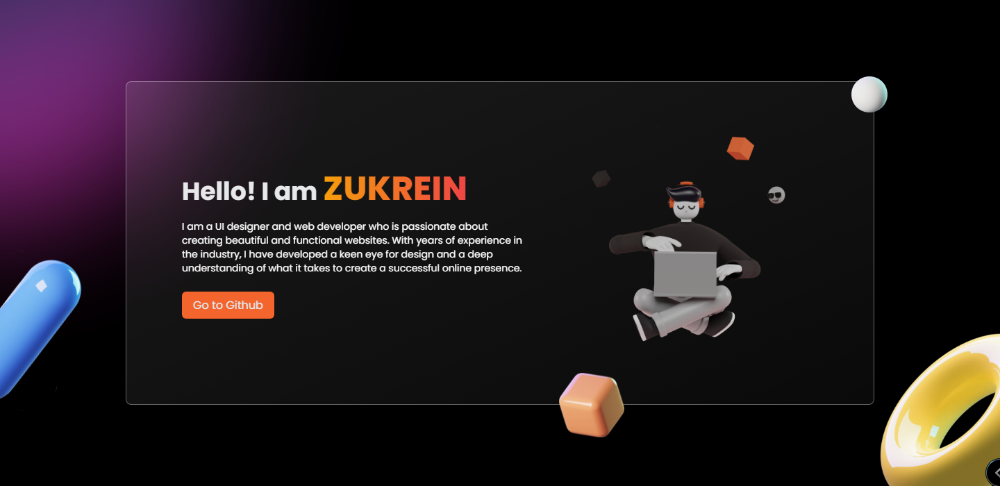

## Built With

My personal portfolio <a  href="https://zukrein.me/"  target="_blank">zukrein.me</a> which features some of my github projects as well as my resume and technical skills. 

This project was built using these technologies.

- Svelte

- SvelteKit

- TailwindCss

- CSS3

- VsCode

- Vercel

## Features

**🎨 Styled with Tailwind Css with easy to customize colors**

**📱 Fully Responsive**

## Getting Started

Clone down this repository. You will need `node.js` and `git` installed globally on your machine.

## 🛠 Installation and Setup Instructions

1. Installation: `npm install`

2. In the project directory, you can run: `npm dev`

Runs the app in the development mode.

Open [http://localhost:3000](http://localhost:3000) to view it in the browser.

The page will reload if you make edits.

### Show your support

Give a ⭐ if you like this website!
